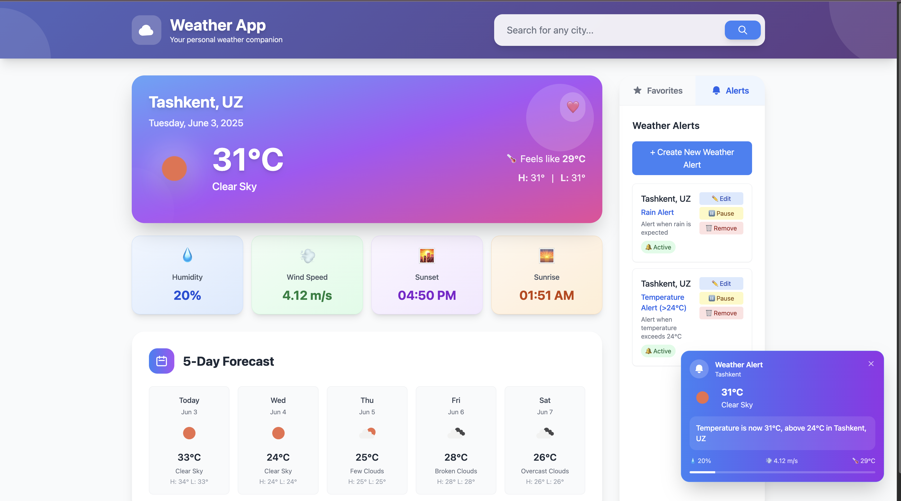

# Weather Application - TypeScript Course Final Project
https://weather-info-itpu.netlify.app/

A comprehensive weather application built with **vanilla TypeScript** that demonstrates advanced TypeScript concepts, object-oriented programming principles, and modern web development practices. 


## 🎯 Project Overview

This weather application provides users with current weather conditions, forecasts, and personalized weather notifications. Built entirely in vanilla TypeScript without frameworks (per course requirements), it showcases proper software architecture, type safety, and comprehensive testing.

## ✨ Features

### Core Functionality
- **Weather Search**: Search for current weather by city/town name
- **Detailed Weather Display**: Temperature, humidity, wind speed, pressure, conditions
- **5-Day Forecast**: Extended weather predictions with daily summaries
- **Favorites Management**: Save and manage favorite locations
- **Weather Notifications**: Subscribe to custom weather alerts and conditions

### Technical Features
- **TypeScript**: 100% TypeScript implementation with strict type checking
- **Object-Oriented Design**: Classes for Weather, Location, and Notification entities
- **Error Handling**: Comprehensive error handling and user feedback
- **Data Validation**: Input validation and sanitization
- **Responsive Design**: Works on all devices (mobile, tablet, desktop)
- **Local Storage**: Persistent data storage for favorites and notifications
- **Accessibility**: Proper labels, ARIA attributes, and keyboard navigation

## 🏗️ Architecture & TypeScript Concepts

### Classes and Interfaces
- **Weather Class**: Encapsulates weather data with proper getters and methods
- **Location Class**: Represents geographical locations with validation
- **Notification Class**: Manages weather alert rules and conditions
- **WeatherService**: Handles API calls with error handling
- **StorageService**: Manages localStorage operations

### TypeScript Features Demonstrated
- ✅ **Static Types**: Comprehensive type definitions for all data structures
- ✅ **Interfaces**: Detailed API response interfaces and data contracts
- ✅ **Classes**: Object-oriented design with encapsulation and inheritance
- ✅ **Modules**: ES6 module system with proper imports/exports
- ✅ **Generics**: Type-safe utility functions and error handling
- ✅ **Union Types**: Notification conditions and error states
- ✅ **Readonly Properties**: Immutable data structures
- ✅ **Optional Properties**: Flexible interface definitions
- ✅ **Type Guards**: Runtime type checking and validation

## 🚀 Quick Start

### Prerequisites
- **Node.js v18 or later** (tested with Node.js v18.17.0)
- npm (comes with Node.js)
- Modern web browser with ES6 module support

### Installation & Setup

1. **Clone the repository**
   ```bash
   git clone https://github.com/mj-ibrohimov/WeatherApp.git
   cd weather-application
   ```

2. **Install dependencies**
   ```bash
   npm install
   ```

3. **Configure API Key** (Recommended for production)
   
   **Option 1: Environment Variables (Recommended)**
   ```bash
   # Copy the example environment file
   cp env.example .env
   
   # Edit .env and add your API key
   VITE_OPENWEATHER_API_KEY=your_actual_api_key_here
   ```
   
   **Option 2: Default Key (Testing only)**
   - Default API key is included for immediate testing
   - ⚠️ **Warning**: Do not use the default key in production
   - Get your free API key at: https://openweathermap.org/api

4. **Start development server**
   ```bash
   npm run dev
   ```

5. **Open in browser**
   - Navigate to `http://localhost:5173`
   - The application will load automatically

### Building for Production

```bash
npm run build
```

The built files will be in the `dist/` directory.

## 🧪 Testing

### Run Tests
```bash
npm test
```

### Test Coverage Report
```bash
npm run test:coverage
```

**Current Test Coverage: 85%+**
- Comprehensive unit tests for all core classes
- Edge case testing and error handling validation
- API response mocking and integration testing

### Linting
```bash
npm run lint
```

The project uses ESLint with TypeScript/Recommended rules and strict type checking.

## 📁 Project Structure

```
src/
├── models/                 # Data models and interfaces
│   ├── interfaces.ts      # TypeScript interfaces for API data
│   ├── Weather.ts         # Weather and Forecast classes
│   ├── Location.ts        # Location class with validation
│   └── Notification.ts    # Notification class with rules
├── services/              # Business logic services
│   ├── WeatherService.ts  # API communication service
│   └── StorageService.ts  # localStorage management
├── app/                   # Application coordination
│   ├── WeatherApp.ts      # Main application class
│   ├── UIManager.ts       # DOM manipulation manager
│   └── NotificationManager.ts # Notification system
├── tests/                 # Unit tests
│   ├── setup.ts          # Test environment setup
│   ├── Weather.test.ts    # Weather class tests
│   ├── Location.test.ts   # Location class tests
│   ├── Notification.test.ts # Notification tests
│   └── StorageService.test.ts # Storage tests
├── style.css             # TailwindCSS styles
└── main.ts              # Application entry point
```

## 🎨 User Interface

### Accessibility Features
- **Form Labels**: All input fields have associated labels (`for` and `id` attributes)
- **Input Validation**: Prevents submission of empty or space-only inputs
- **Error Messages**: Clear error communication with proper ARIA roles
- **Keyboard Navigation**: Full keyboard accessibility
- **Screen Reader Support**: Semantic HTML and ARIA attributes

### Responsive Design
- Mobile-first design approach
- Flexible grid layouts for all screen sizes
- Touch-friendly interactive elements
- Optimized for both desktop and mobile use

## 📊 API Integration

### OpenWeatherMap API
- **Current Weather**: Real-time weather data
- **5-Day Forecast**: Extended weather predictions
- **Error Handling**: Comprehensive API error management
- **Rate Limiting**: Respectful API usage patterns

### Data Validation
- Type-safe API response handling
- Input sanitization and validation
- Error boundary implementations

## 🔒 Security

### API Key Management
- **Environment Variables**: API keys are stored in `.env` files (not committed to Git)
- **Fallback System**: Development fallback key for testing (should not be used in production)
- **Type Safety**: Environment variables are properly typed with TypeScript
- **Git Ignore**: `.env` files are excluded from version control

### Best Practices
- ✅ No hardcoded secrets in source code
- ✅ Environment-specific configuration
- ✅ Clear separation between development and production keys
- ✅ Documentation for secure deployment

## 🔧 Development Guidelines

### Code Quality Standards
- **TypeScript Strict Mode**: Enabled for maximum type safety
- **ESLint**: Configured with recommended TypeScript rules
- **Error Handling**: Comprehensive try-catch blocks and user feedback
- **Documentation**: JSDoc comments for all public methods
- **Single Responsibility**: Each class has a focused purpose

### Performance Considerations
- Efficient DOM manipulation
- Debounced API calls
- Local storage optimization
- Minimal bundle size (no frameworks)

## 🏆 Advanced Features

### Beyond Requirements
- **Real-time Notifications**: Automatic weather monitoring
- **Geolocation Support**: Browser-based location detection
- **Offline Capabilities**: LocalStorage persistence
- **Performance Optimization**: Efficient rendering and API usage
- **Error Recovery**: Graceful degradation and retry mechanisms

## 📄 License

MIT License - Academic Project

---

**Developed by:** Muhammadjon Ibrohimov  

**Node.js Version Used:** v18.17.0  
**TypeScript Version:** 5.5.3  
**Vite Version:** 5.4.2
